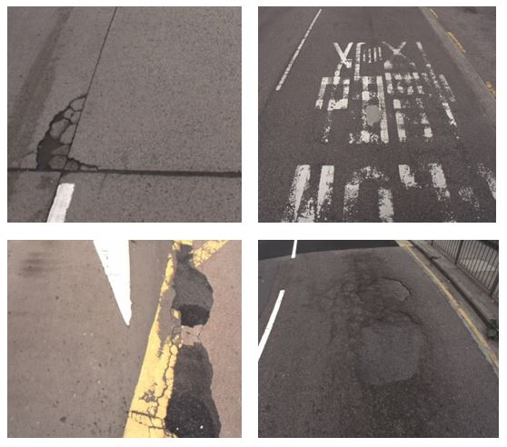

# Introduction

This Github is using for the training workshop of "AI Visual Inspection system for road defection".
You may download the handouts and try the program codes by yourself. There are also suggested solutions in the website.

# Objective
The goal of the workshop is to provide basic understanding of Python and machine learning. Students may use the skills in the workshop to train their model for their visual inspection system.

# Dataset
Please download the dataset from my drive.
https://drive.google.com/drive/folders/1CD11qRlmtbo4R43Dj9Xpp-xdxAq9LmYj?usp=sharing
